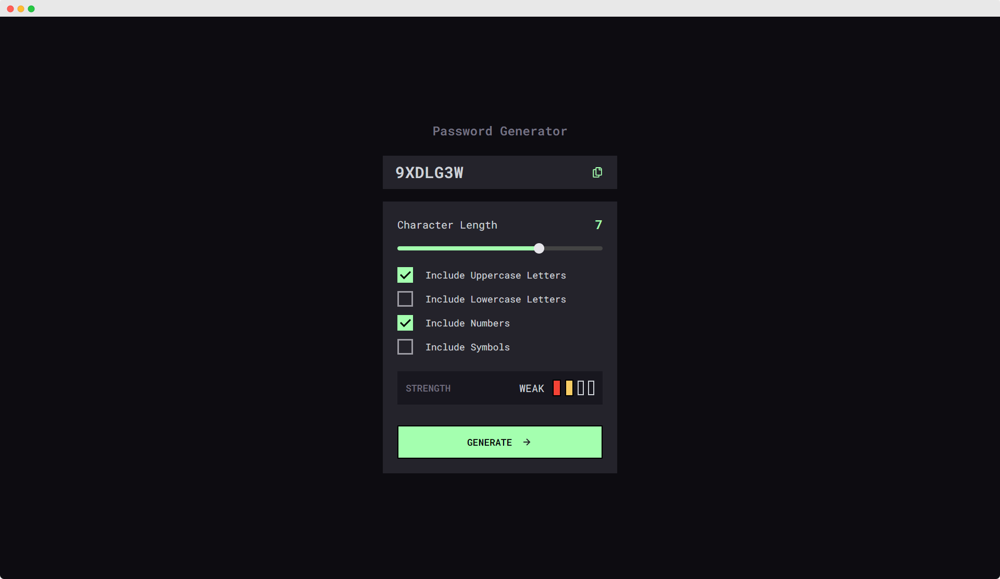

# Password Generator

## 🚀 Brief Overview

Introducing Password Generator, a powerful and intuitive web app designed to help users create secure passwords effortlessly. Built with modern technologies like React.js, TypeScript, and Tailwind CSS, this app provides a smooth, responsive experience and a sleek design. Featuring a password strength meter with four levels, users can instantly gauge the security of their passwords. With an emphasis on speed, performance, and ease of use, "Password Generator" simplifies the process of generating strong, secure passwords for better online protection.

## ✨ Key Features

1. Responsive Design
2. Awesome Design thanks to **tailwind**.
3. Nice perfomance.

## 🛠️ Tech Stack

- React.js
- TailwindCSS
- TypeScript

## 🔧 Install Instructions

1. Clone the repo

```bash
    git clone https://github.com/ahmedmohmd/password-generator.git

```

2. Install dependencies

```bash
  yarn install

```

3. Run the App

```bash
  yarn run dev

```

## 🖥️ Usage

1. You can geenrate password with different levels:

- Too Week
- Weak
- Medium
- Strong

2. You can control what type of char can generated password includes:

- Include Uppercase Letters
- Include Lowercase Letters
- Include Numbers
- Include Symbols

## 👀 Demo

[Password Generator](https://p3ssword-generator.vercel.app/)

## 🖼️ Application's Screeshots


